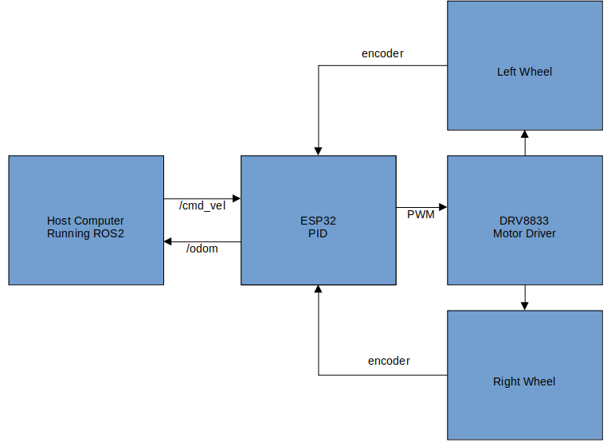

# Overview
* This is a PlatformIO program to create a ROS2 /odom publisher and /cmd_vel subscriber by an ESP32
* I used an "ESP32 D1 Mini" but any ESP32 should be ok
* This projects comes from my demo project https://github.com/guido57/uros_demo
* Besides, this project is pretty similar to https://www.hackster.io/amal-shaji/differential-drive-robot-using-ros2-and-esp32-aae289#overview, apart from the use of PlatformIO.
* To better understand the encoder reading, look at https://www.hackster.io/amal-shaji/reading-the-encoder-value-of-n20-motor-using-esp32-56575a

# Block Diagram



  
# Build and run

## Download this project
* git clone or download this project
* open it with VS Code
* create the file credentials.h in the src directory and fill it with your wifi and ros2 agent credentials

  e.g.
  ```
  String ssid = "ssid_name"
  String pass = "ssid_password"
  IPAddress ros2_agent_ipa = IPAddress(192,168,1,13);
  int ros2_agent_port = 8888;
  ```

## Run the micro-ROS agent on a PC in your network
* https://technologiehub.at/project-posts/micro-ros-on-esp32-tutorial/#:~:text=1.%20Create%20the%20micro%2DROS%20Agent

## Run this firmware
* build and upload this firmware to your ESP32,
* If everything is ok, from the serial of the ESP32 you should see:
  ```
    setup ...
    ...
    Connected to Wi-Fi
    IP Address: 192.168.1.217
    create init_options...
    create node...
    create publisher...
    create subscriber...
    end of setup!
   ```
* At the same time on the terminal where you run the micro_ROS agent:
  ```
  [1734173822.950637] info     | Root.cpp           | create_client            | create                 | client_key: 0x2E459F81, session_id: 0x81
  [1734173822.950767] info     | SessionManager.hpp | establish_session        | session established    | client_key: 0x2E459F81, address: 192.168.1.217:47138
  [1734173822.971688] info     | ProxyClient.cpp    | create_participant       | participant created    | client_key: 0x2E459F81, participant_id: 0x000(1)
  [1734173822.981610] info     | ProxyClient.cpp    | create_topic             | topic created          | client_key: 0x2E459F81, topic_id: 0x000(2), participant_id: 0x000(1)
  [1734173822.989613] info     | ProxyClient.cpp    | create_publisher         | publisher created      | client_key: 0x2E459F81, publisher_id: 0x000(3), participant_id: 0x000(1)
  [1734173822.997994] info     | ProxyClient.cpp    | create_datawriter        | datawriter created     | client_key: 0x2E459F81, datawriter_id: 0x000(5), publisher_id: 0x000(3)
  [1734173823.008845] info     | ProxyClient.cpp    | create_topic             | topic created          | client_key: 0x2E459F81, topic_id: 0x001(2), participant_id: 0x000(1)
  [1734173823.016997] info     | ProxyClient.cpp    | create_subscriber        | subscriber created     | client_key: 0x2E459F81, subscriber_id: 0x000(4), participant_id: 0x000(1)
  [1734173823.025724] info     | ProxyClient.cpp    | create_datareader        | datareader created     | client_key: 0x2E459F81, datareader_id: 0x000(6), subscriber_id: 0x000(4)
  ```
  
## Test

I only tested this project using my PC running Ubuntu 22.04 with ROS2 Humble.

### /odom Publisher

The ESP32 publishes a standard /odom topic. which can be read by rviz2 or nav2.
  ```
  ros2 topic echo /odom --field pose.pose
  ```
you should see something like:
  ```
  position:
    x: 0.041983988136053085
    y: -0.002503202995285392
    z: 0.0
  orientation:
    x: 0.0
    y: 0.0
    z: 0.05259290913491116
    w: 0.9986160352751837
  ---
  ```

### Subscriber

The ESP32 subscribed to /sub_topic_name, so if you publish some Integer value to it:
  ```
  ros2 topic pub /sub_topic_name std_msgs/msg/Int32 "data: 42" --once
  ```
you should see something like this from the serial of the ESP32:
  ```
  Received message: 42
  ```


